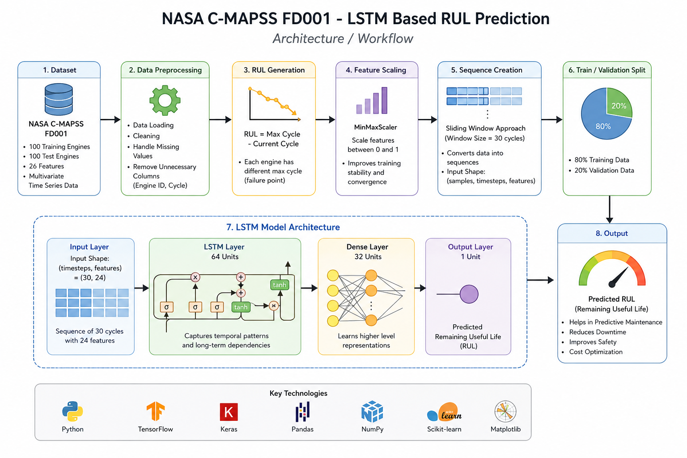

# Predictive Maintenance using NASA C-MAPSS FD001 and LSTM Networks


## Overview

This project presents a deep learning-based predictive maintenance system for estimating the Remaining Useful Life (RUL) of aircraft turbofan engines using NASA's C-MAPSS FD001 dataset.

An LSTM (Long Short-Term Memory) neural network is trained on multivariate sensor measurements to learn engine degradation patterns and predict the number of operational cycles remaining before failure.

The proposed system demonstrates the application of sequence learning techniques in Prognostics and Health Management (PHM), enabling data-driven maintenance scheduling and failure prevention.

---

## Objectives

* Predict Remaining Useful Life (RUL) of aircraft engines
* Learn degradation patterns from time-series sensor data
* Implement an end-to-end predictive maintenance pipeline
* Apply deep learning techniques to industrial prognostics
* Evaluate model performance on unseen validation data

---

## Dataset

### NASA C-MAPSS FD001

The Commercial Modular Aero-Propulsion System Simulation (C-MAPSS) dataset developed by NASA contains run-to-failure simulations of turbofan engines.

| Feature              | Value           |
| -------------------- | --------------- |
| Training Engines     | 100             |
| Test Engines         | 100             |
| Sensor Measurements  | 21              |
| Operational Settings | 3               |
| Total Features       | 26              |
| Operating Conditions | 1               |
| Fault Mode           | HPC Degradation |

---

## Architecture



### Workflow

```text id="pkhlbf"
NASA C-MAPSS Dataset
        │
        ▼
Data Loading
        │
        ▼
Data Preprocessing
        │
        ▼
RUL Generation
        │
        ▼
Feature Scaling
        │
        ▼
Sequence Creation
        │
        ▼
Train / Validation Split
        │
        ▼
LSTM Model
        │
        ▼
Training
        │
        ▼
Evaluation
        │
        ▼
RUL Prediction
```

---

## Data Preprocessing

### Remaining Useful Life Generation

The target variable was generated using:

```python id="6b4sj7"
RUL = Max_Cycle - Current_Cycle
```

### Feature Scaling

Sensor measurements were normalized using MinMaxScaler.

### Sequence Generation

A sliding window approach was used to create sequences of 30 operational cycles for LSTM training.

---

## Model Architecture

```python id="96h8yw"
model = Sequential([
    LSTM(64),
    Dense(32, activation='relu'),
    Dense(1)
])
```

| Layer  | Configuration   |
| ------ | --------------- |
| LSTM   | 64 Units        |
| Dense  | 32 Units + ReLU |
| Output | 1 Unit          |

---

## Training Configuration

| Parameter     | Value               |
| ------------- | ------------------- |
| Optimizer     | Adam                |
| Loss Function | Mean Squared Error  |
| Metric        | Mean Absolute Error |
| Epochs        | 20                  |
| Batch Size    | 64                  |

---

## Results

### Sample Predictions

```text id="tpk1po"
135.62
193.31
177.72
140.79
67.97
```

### Prediction Performance


The scatter plot compares actual RUL values with model predictions. Points closer to the diagonal line indicate stronger predictive performance.

---

## Repository Structure

```text id="7f6f7m"
Predictive-Maintenance-NASA-CMAPSS-LSTM/
│
├── data/
├── docs/
├── images/
├── models/
├── notebooks/
├── requirements.txt
├── .gitignore
├── README.md
└── LICENSE
```

---

## Installation

```bash id="m2jf0u"
git clone https://github.com/yourusername/Predictive-Maintenance-NASA-CMAPSS-LSTM.git

cd Predictive-Maintenance-NASA-CMAPSS-LSTM

pip install -r requirements.txt
```

---

## Technologies Used

* Python
* TensorFlow
* Keras
* NumPy
* Pandas
* Matplotlib
* Scikit-Learn

---

## Applications

* Predictive Maintenance
* Aircraft Engine Health Monitoring
* Industrial IoT
* Reliability Engineering
* Asset Health Monitoring
* Smart Manufacturing

---

## Reference

Saxena, A., Goebel, K., Simon, D., & Eklund, N.

Damage Propagation Modeling for Aircraft Engine Run-to-Failure Simulation.

NASA Prognostics and Health Management Conference, 2008.

---

## Future Work

* Bidirectional LSTM Networks
* GRU-Based Models
* Transformer Architectures
* Explainable AI Techniques
* Hyperparameter Optimization
* Real-Time Deployment Dashboard

---

## Author

Ram

Machine Learning | Deep Learning | Predictive Maintenance | Prognostics and Health Management
